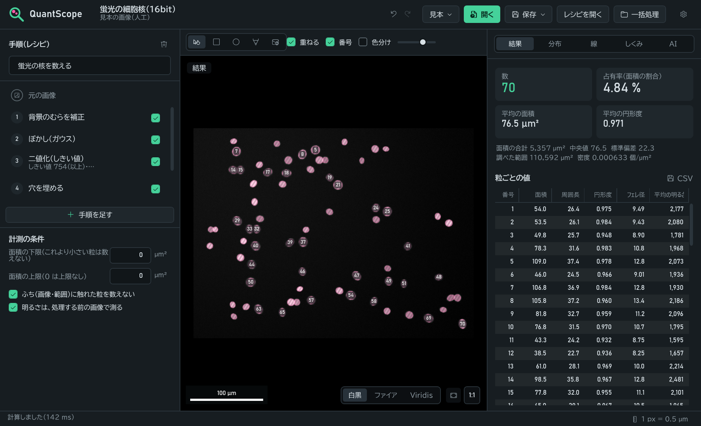
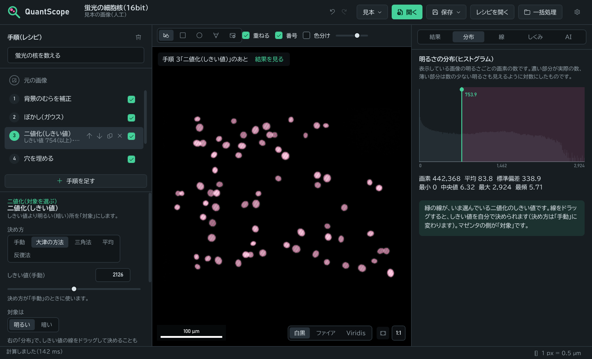
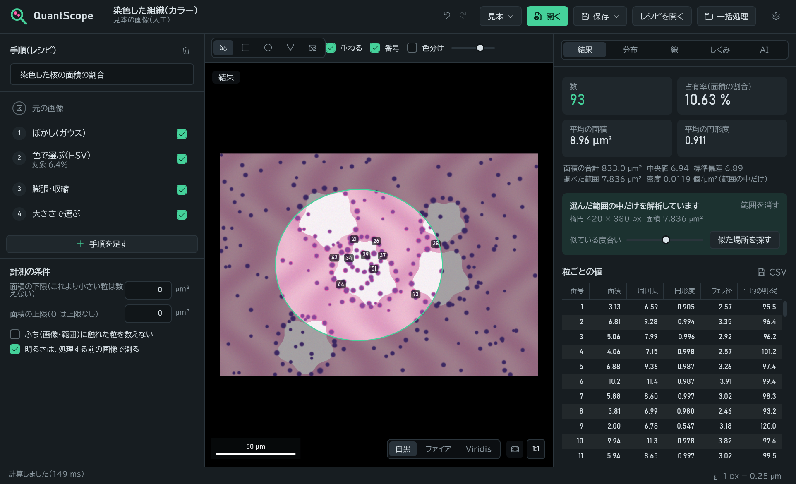
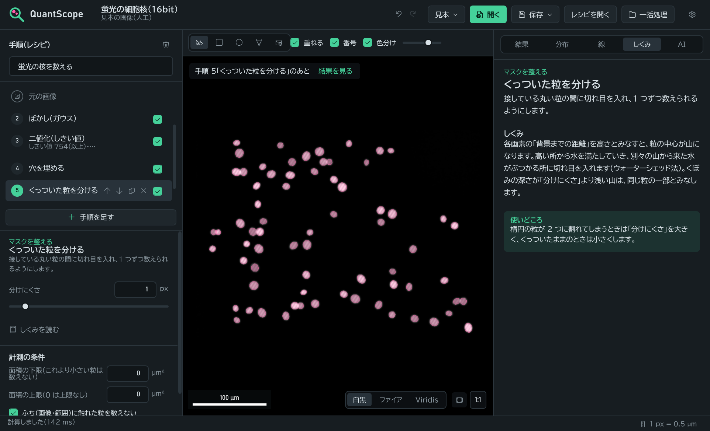
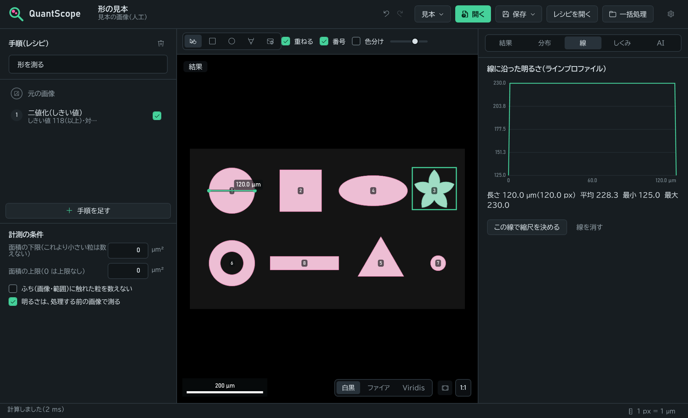

# QuantScope — 画像から、数える・測る

顕微鏡の画像や医用画像を、**ぼかし → 二値化 → 形を整える** と手順を積み重ねて解析し、粒（細胞の核・粒子など）の **数・面積・形・明るさ** を測る Windows アプリです。
手順は **レシピ** として保存でき、フォルダーの画像すべてに同じ解析を **一括** でかけられます。
どの手順も「しくみ」を読みながら試せるので、画像処理を学ぶ教材としても使えます。

> **研究・学習用のソフトウェアです。** 医療機器ではなく、診断には使えません。



## できること

| | |
| --- | --- |
| **読み込み** | PNG・JPEG・TIFF（16 bit の白黒・カラーも）・BMP・GIF・DICOM（CT の HU、画素間隔を縮尺に）。ドロップでも開ける |
| **手順（レシピ）** | 29 種類の処理を好きな順に積み重ねる。値を変えると、その手順から先だけを計算し直す。オン・オフ・並べ替え・複製・元に戻す |
| **明るさ・色** | 白黒・色の取り出し・反転・ウインドウ／レベル・自動コントラスト・ガンマ・ヒストグラム平坦化・局所コントラスト（CLAHE） |
| **フィルター** | ガウスぼかし・メディアン・鮮鋭化・輪郭（Sobel）・背景のむらの補正・ノイズを加える（練習用） |
| **二値化** | しきい値（手動・大津・三角法・平均・反復法）、色で選ぶ（HSV）、k-means。ヒストグラムの線をドラッグしてしきい値を決められる |
| **マスクを整える** | 膨張・収縮・オープニング・クロージング（正確な円）、穴埋め、**くっついた粒を分ける**（ウォーターシェッド）、大きさで選ぶ、ふちの粒を除く |
| **計測** | 粒ごとに面積・周囲長・円形度・相当直径・楕円（長軸・短軸・角度）・縦横比・フェレ径・充実度・明るさ（平均・SD・最小・最大・合計）。全体の数・占有率・密度 |
| **範囲と縮尺** | 四角・楕円・多角形の範囲の中だけを解析。線の長さ・ラインプロファイル。スケールバーに線を引いて縮尺（µm / mm）を決める |
| **似た場所を探す** | 範囲の模様と似た所を、正規化相互相関で画像全体から探す |
| **書き出し** | 計測結果（CSV、Excel で文字化けしない）、重ねた画像・マスク・処理後の画像（PNG）、レシピ（JSON） |
| **一括処理** | フォルダーの画像に同じレシピをかけ、まとめと粒ごとの CSV、確認用の重ねた画像を書き出す |
| **AI の説明（任意）** | 表示している画像を OpenAI に説明してもらう。キーは使う人が設定し、暗号化して保存 |
| **見本** | 蛍光の細胞核（16 bit）・染色した組織（カラー）・形の見本。人工の画像なので、データがなくても試せる |

<table>
<tr>
<td></td>
<td></td>
</tr>
<tr><td align="center">しきい値の線を、分布を見ながら決める</td><td align="center">色で核を選び、範囲の中の占有率を測る</td></tr>
<tr>
<td></td>
<td></td>
</tr>
<tr><td align="center">くっついた核を分け、粒ごとに色分け。右に「しくみ」</td><td align="center">形の見本: 選んだ粒（星）と、線の長さ・明るさの変化</td></tr>
</table>

画面の色は 2 つに絞っています。操作と「選んでいるもの」はミントの緑、画像の上の対象（マスク）はマゼンタ。緑とマゼンタは互いの補色なので、どんな染色の画像の上でも見分けやすくなります。

## しくみ

画像処理と計測はすべて、画面に依存しない `QuantScope.Core` に自作しています（外部の画像処理ライブラリを使っていません）。Linux の CI でもテストしています。

| 部分 | やり方 |
| --- | --- |
| しきい値 | 大津の判別分析（組の間の分散が最大の値。最大が続くときはその中央）・三角法・反復法。16 bit の画像は、実際に使っている範囲で分布を作る |
| 膨張・収縮 | ユークリッド距離変換（Felzenszwalb と Huttenlocher の方法）で、半径が大きくても速く、形が正確な円になる |
| くっついた粒を分ける | 距離変換の山を高い順に満たしていき、別々の山がぶつかる所に 1 画素の切れ目を入れる。くぼみの浅い山は「持続性」で同じ粒にまとめ、楕円が割れすぎないようにする |
| 周囲長 | 外側の輪郭を Moore 近傍でなぞり、チェーンコードに Vossepoel と Smeulders の重みをかける（画素の階段をそのまま数えると、円で数 % 長くなる） |
| 楕円・フェレ径・充実度 | 2 次のモーメントから楕円を当てはめる。凸包（単調連鎖法）から、いちばん長い差し渡しと充実度 |
| CLAHE | 区画ごとにクリップしたヒストグラムで平坦化し、区画の中心どうしを双線形に補間 |
| 大きな σ のぼかし | 箱型のぼかしを 3 回重ねてガウスを近似（σ によらず計算量が一定） |
| 再計算 | 手順ごとの結果を覚えておき、値を変えた手順から先だけを計算し直す |

### テスト（65 件）

- 計測: 円の面積が理論値の 1% 以内・周囲長 3% 以内・円形度 0.95 以上。正方形のフェレ径が対角線。傾けた楕円の長軸・短軸・角度。縮尺をかけたときの面積と長さ
- 距離変換が総当たりの計算と一致・膨張が正確な円の格子点の数になる
- くっついた 2 つの円は 2 つに分かれ、1 つの楕円は分かれない
- **見本の蛍光の核（70 個、うち 6 組はくっついている）を、レシピどおりに数えると 70 個**
- しきい値（大津・三角法・反復法）、色の範囲（0° をまたぐ色相）、k-means が毎回同じ結果
- レシピの保存と読み戻し・壊れたレシピは理由を添えて断る・一括処理は読めない画像があっても続ける
- CSV は地域の設定によらず小数点が「.」・表計算ソフトで式として実行されない
- DICOM（HU・画素間隔・MONOCHROME1）・AI に送る内容（画像と手順と数値だけ）・キーをエラーの文に出さない

### 元のアプリからの主な改善

授業の課題で作った画像処理アプリ（WinForms）をもとに、研究・学習用の解析ツールとして作り直しました。

- 処理を 1 回ずつ画像に上書きするのではなく、**手順の並び（レシピ）** として持ち、いつでも値を直して計算し直せるようにした。保存して一括処理にも使える
- 「面積・占有率」を、しきい値以上の画素を数えるだけでなく、**粒ごとの計測**（ラベリング・形・明るさ）と、範囲・縮尺を使った値にした
- 画素ごとの `GetPixel` を使わず、配列と並列処理で計算（2000 × 1500 のカラー画像で、ほとんどの手順が 0.1〜0.8 秒）
- AI の **API キーがソースコードに直接書かれていた**のをやめ、使う人が設定する形にして、DPAPI で暗号化して保存するようにした
- 写真の効果（セピア・エンボス・波紋など）は、解析の目的に合わないため外した

## 使ってみる

- 配布版: [Releases](../../releases) の zip を展開して `QuantScope.exe` を起動（.NET のインストール不要）
- 「見本」から、蛍光の核・染色した組織・形の見本を開くと、手順の例が入った状態で試せます
- 実際の顕微鏡の画像で試すなら、[Broad Bioimage Benchmark Collection](https://bbbc.broadinstitute.org/) などの公開データが使えます。データセットごとに利用条件が違うので、各ページで確認してください

| 操作 | |
| --- | --- |
| 拡大・縮小 | ホイール（マウスの位置を中心に） |
| 移動 | 右ドラッグ・中ボタンのドラッグ（「移動」の道具なら左ドラッグも） |
| 全体を表示 / 等倍 | `F` / `1`、ダブルクリック |
| 道具 | `V` 移動・`R` 四角・`E` 楕円・`P` 多角形・`L` 線（`Shift` で正方形・円・45° ごと） |
| 元に戻す / やり直す | `Ctrl+Z` / `Ctrl+Y` |
| 手順を消す | 一覧で `Delete` |

## 開発

```bash
# .NET 10 SDK
dotnet build QuantScope.slnx
dotnet test --solution QuantScope.slnx
dotnet run --project src/QuantScope.App

# 見本で画面を一通り開き、画像に保存（docs/screenshots の作り方。一括処理と画像の読み書きも確かめる）
QuantScope.exe --snapshots docs/screenshots
```

```
src/QuantScope.Core/   画像処理と計測（画面に依存しない。テスト対象）
  Imaging/     画像・マスク・範囲・縮尺・ヒストグラム
  Processing/  明るさ・フィルター・形・しきい値・k-means・距離変換・膨張収縮・ウォーターシェッド
  Analysis/    ラベリング・粒子解析・ラインプロファイル・似た場所を探す・CSV
  Pipeline/    手順の一覧（名前・しくみの説明・値の定義）・レシピ・再計算・一括処理
  Dicom/ Ai/ Samples/ Rendering/
src/QuantScope.App/    WPF の画面（MVVM）
tests/QuantScope.Tests/
```

## 制限と今後

- 3D（複数の断面の重なり）や時間で変わる画像（タイムラプス）は、最初の 1 枚だけを読む
- 計測の値は画素と縮尺から計算した推定値で、画像の解像度より細かいものは正しく測れない
- 今後: Web カメラ・顕微鏡のカメラからの取り込み、チャンネルの重ね合わせ（多重染色）、手順の結果をまとめたレポートの書き出し

## ライセンス

[MIT](LICENSE)。使っているソフトウェアは [THIRD_PARTY_NOTICES.md](THIRD_PARTY_NOTICES.md)。
